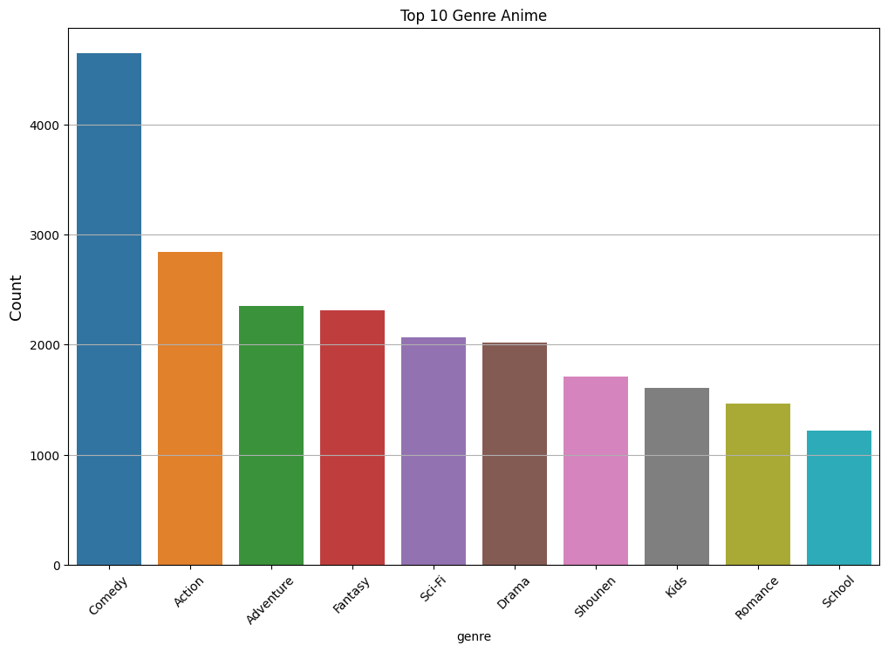
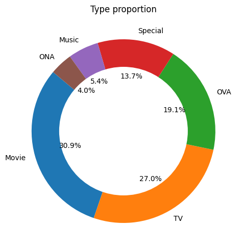
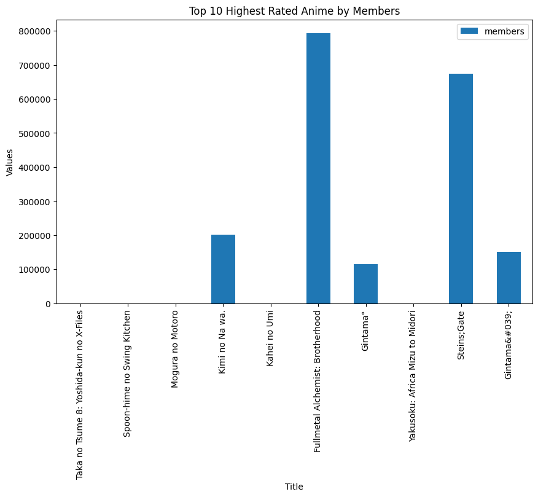
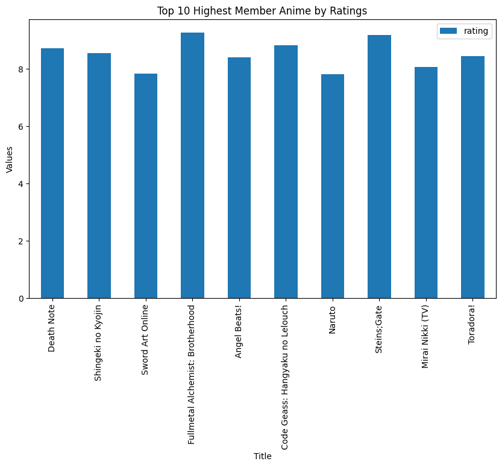

 
 

<b>Anime Recommendation System</b>

 
 

Nama    : Muhammad Reesa Rosyid

Email   : mreesa669@gmail.com

<h1 align='center'>Project Overview</h1>

***
Sistem rekomendasi adalah aplikasi yang sangat berguna dalam menghadirkan konten yang relevan kepada pengguna berdasarkan preferensi mereka[1]. Dalam konteks anime, sistem rekomendasi dapat membantu penggemar menemukan anime yang sesuai dengan minat dan selera mereka. Ada dua pendekatan utama yang digunakan dalam pengembangan sistem rekomendasi anime: content-based filtering dan collaborative filtering. Content-based filtering adalah salah satu metode rekomendasi yang mengandalkan analisis konten atau atribut dari item yang direkomendasikan[2]. Dalam konteks anime, atribut ini dapat mencakup genre, direktur, studio produksi, karakteristik plot, dan lain sebagainya. Sistem content-based filtering akan membandingkan preferensi pengguna dengan atribut-atribut ini untuk menyajikan rekomendasi yang cocok. Collaborative filtering adalah metode rekomendasi yang mengandalkan informasi dari pengguna lain untuk membuat rekomendasi[3]. Ini memanfaatkan pola perilaku pengguna yang mirip atau data historis dari sejumlah besar pengguna untuk menyajikan rekomendasi yang relevan. Dalam konteks anime, ini bisa berarti mengidentifikasi pengguna dengan minat yang serupa dan merekomendasikan anime yang disukai oleh pengguna serupa.

<h1 align='center'>Business Understanding</h1>

***

## Problem Statement

1. Bagaimana cara mendapatkan rekomendasi anime sesuai dengan genre yang pengguna suka?
2. Bagaimana cara mendapatkan rekomendasi anime berdasarkan aktivitas rating pengguna lain?

## Goals

1. Mendapatkan rekomendasi anime sesuai dengan genre yang pengguna suka dapat dibuat dengan metode system recomendation Contents Based Filtering.
2. Mendapatkan rekomendasi anime berdasarkan aktivitas rating pengguna lain dapat dibuat dengan metode system recomendation Collaborative Filtering.

<h1 align='center'>Data Understanding</h1>

***

Dataset ini merupakan data yang terdapat preferensi pengguna dari 73,516 orang terhadap 12,294 judul anime. Setiap pengguna dapat menambahkan anime yang dia sudah tonton dan dapat pula memberikan rating. Sehingga data ini juga merupakan kompilasi dari rating tersebut. Dataset ini dibagai ke dalam dua dokumen csv, yaitu anime.csv dan rating.csv. Perbedaan dari kedua data tersebut ialah, data anime.csv menampilkan title anime dan rating anime tersebut secara menyeluruh, sedangkan data rating.csv menampilkan rating yang telah diberikan oleh user.  Dataset ini penulis dapatkan dari kaggle dengan link sebagai berikut: [Link Dataset](https://www.kaggle.com/datasets/CooperUnion/anime-recommendations-database).

## Univariate Exploratory Data Analysis

<b>CONTENT</b>

Anime.csv:
* anime_id: id unik yang berasal dari [MyAnimeList.net](https://myanimelist.net/).
* name: judul dari anime.
* genre: genre dari anime tersebut.
* type: tipe dari anime tersebut. Seperti movie, TV, OVA, dan sebagainya.
* episodes: berapa banyak episode dalam anime tersebut. Jika hanya 1 episode maka dipastikan anime tersebut merupakan tipe movie.
* rating: rating ini merupakan rata-rata yang diberikan dari semua user.
* member: angka dari komunitas member yang berada pada grup suatu anime. Dengan kata lain, member merupakan total fanbase pada anime tersebut.

Rating.csv:
* user_id: id pengguna yang dihasilkan secara acak dan tidak dapat diidentifikasi.
* anime_id: sebuah anime yang telah di rating oleh user.
* rating: rating yang diberikan oleh user. Jika terdapat value -1, maka user telah menonton anime tersebut namun tidak memberikan rating.

### Feature Genre

Pada bagian ini, akan dilihat genre apa yang paling banyak pada dataset tersebut.

Genre yang paling banyak pada dataset tersebut adalah comedy dengan jumlah lebih dari 4000 judul anime yang mengusung genre comedy, lalu di ikuti oleh action, dan seterusnya.

### Feature Type

Akan dilihat dari feature Type, tipe anime apa saja yang paling banyak pada dataset tersebut.

Dapat dilihat anime move dan TV memiliki prosentase paling tinggi yaitu movie berjumlah 30.9% dan TV 27%.

### Feature Rating & Members

Pada bagian ini akan dilihat anime dengan rating tertinggi dan member terbanyak. Perlu diketahui bahwa suatu anime yang mendapatkan rating tinggi bukan berarti anime tersebut bagus secara keseluruhan. Sebagai contoh, misalkan terdapat anime A dengan rating 9.7/10 namun anime tersebut hanya memiliki member <100 orang, dan anime B dengan rating 8.5/10 namun memiliki member >1000000 orang. Maka anime A belum tentu lebih baik dari pada Anime B secara keseluruhan. Hal itu dapat dibuktikan dengan bar chart di bawah ini.

| Name                                    | Members |
|-----------------------------------------|---------|
| Taka no Tsume 8: Yoshida-kun no X-Files | 13      |
| Spoon-hime no Swing Kitchen             | 47      |
| Mogura no Motoro                        | 62      |
| Kimi no Na wa.                          | 200630  |
| Kahei no Umi                            | 44      |
| Fullmetal Alchemist: Brotherhood        | 793665  |
| Gintama°                                | 114262  |
| Yakusoku: Africa Mizu to Midori         | 53      |
| Steins;Gate                             | 673572  |
| Gintama'                                | 151266  |

Dari plot chart di atas selaras dengan apa yang penulis utarakan. Taka no Tsume 8: Yoshida-kun no X-Files memiliki rating paling tinggi namun hanya memiliki 13 member sedangkan Fullmetal Alchemist: Brotherhood berada di bawahnya namun memiliki member yang jauh lebih banyak yaitu sebanyak 793665 member. Untuk itu akan dibalik, plot yang awalnya diukur berdasarkan rating tertinggi, di bawah ini akan dilakukan plot berdasarkan member terbanyak.

| Name                              | Rating |
|-----------------------------------|--------|
| Death Note                        | 8.71   |
| Shingeki no Kyojin                | 8.54   |
| Sword Art Online                  | 7.83   |
| Fullmetal Alchemist: Brotherhood  | 9.26   |
| Angel Beats!                      | 8.39   |
| Code Geass: Hangyaku no Lelouch   | 8.83   |
| Naruto                            | 7.81   |
| Steins;Gate                       | 9.17   |
| Mirai Nikki (TV)                  | 8.07   |
| Toradora!                         | 8.45   |

Hasilnya dapat dilihat bahwa Fullmetal Alchemist: Brotherhood memiliki rating paling tinggi yaitu 9.26 dan memiliki member kurang lebih 700000 orang berdasarkan plot Top 10 Highest Rated Anime by Members.

<h1 align='center'>Data Preparation</h1>

***

## Conten Based Filtering Preparation

Menggabungkan rating_df dan anime_df berdasarkan anime_id. Selanjutya pada proses data cleaning akan dilakukan pengecekan missing value dan akan drop value tersebut apabila missing. Proses kedua ialah mengecek data yang terindikasi duplikat, apabila terdapat data duplikat maka data tersebut juga akan di drop.

## Collaborative Filtering Preparation

Data rating_df diperlukan untuk melatih model dengan metode collaborative filtering, dikarenakan data tersebut berisikan penonton anime yang merating anime/film yang telah ditonton. Hal tersebut dapat menjadi suatu sistem rekomendasi dari pengguna ke pengguna lain. Tahap pertama ialah data cleaning ulang pada rating_df, Terdapat rating -1, dapat dilihat pada informasi dataset bahwa rating -1 dari user berarti user yang telah menonton suatu anime namun tidak merating anime tersebut. Maka nilai -1 akan dilakukan drop. Lalu melakukan encoder pada user_id dan anime_id. Proses terakhir adalah pembagian train test data, degan proportsi 80:20.

<h1 align='center'>Modeling</h1>

***

# Model Development Content Based Filtering

Content-based filtering adalah sebuah metode dalam sistem rekomendasi yang digunakan untuk memberikan rekomendasi kepada pengguna berdasarkan karakteristik atau konten dari item atau produk yang telah mereka sukai atau konsumsi sebelumnya. Metode ini memeriksa kesamaan antara item yang telah disukai oleh pengguna dan item-item lainnya berdasarkan fitur atau atribut tertentu.

Berikut adalah beberapa karakteristik utama dari content-based filtering:
1. Ekstraksi Fitur: Sistem content-based filtering pertama-tama mengidentifikasi fitur atau atribut yang relevan dari item atau produk yang ingin direkomendasikan. Misalnya, dalam sistem rekomendasi film, fitur-fitur bisa mencakup genre, sutradara, aktor, tahun rilis, dan lain sebagainya.
2. Profil Pengguna: Sistem ini juga membangun profil pengguna berdasarkan preferensi mereka terhadap item-item yang telah mereka beri peringkat atau konsumsi sebelumnya. Profil ini mencerminkan preferensi pengguna terhadap atribut-atribut tertentu.
3. Perbandingan Berbasis Kesamaan: Sistem kemudian mencari item-item lain yang memiliki kesamaan dengan preferensi pengguna berdasarkan atribut-atribut yang ada dalam profil pengguna. Ini bisa dilakukan dengan menggunakan berbagai metode perbandingan, seperti perhitungan kesamaan kosinus atau algoritma lainnya.
4. Rekomendasi: Setelah sistem mengidentifikasi item yang mirip dengan preferensi pengguna, ia akan merekomendasikan item-item tersebut kepada pengguna.

Keuntungan dari content-based filtering adalah bahwa ia dapat memberikan rekomendasi yang lebih personal karena mempertimbangkan preferensi individu pengguna. Namun, batas utamanya adalah kurangnya variasi dalam rekomendasi, karena hanya akan merekomendasikan item yang mirip dengan yang sudah disukai pengguna.

## TF_IDF Vectorizer

Tfidf Vectorizer adalah alat atau komponen yang digunakan dalam pemrosesan teks untuk mengubah teks menjadi vektor numerik berdasarkan nilai tf-idf. Ini adalah salah satu tahap yang umumnya diterapkan dalam pemrosesan teks sebelum menerapkan berbagai algoritma pembelajaran mesin atau analisis statistik.

Berikut adalah cara kerja Tfidf Vectorizer:
1. Term Frequency (TF): Ini mengukur seberapa sering kata atau istilah tertentu muncul dalam suatu dokumen. Ini dapat dihitung dengan cara menghitung jumlah kemunculan kata tersebut dalam dokumen dan kemudian dibagi dengan jumlah total kata dalam dokumen.
2. Inverse Document Frequency (IDF): Ini mengukur seberapa pentingnya suatu kata atau istilah dalam seluruh koleksi dokumen. Kata yang muncul lebih sering dalam banyak dokumen akan memiliki nilai IDF yang lebih rendah, sedangkan kata yang jarang muncul akan memiliki nilai IDF yang lebih tinggi. IDF dihitung dengan rumus logaritmik yang melibatkan jumlah total dokumen dalam koleksi dan jumlah dokumen yang mengandung kata tersebut.
3. Tf-idf Score: Ini adalah hasil perkalian antara nilai TF dan IDF untuk suatu kata dalam suatu dokumen. Dengan demikian, kata-kata yang sering muncul dalam suatu dokumen tetapi jarang muncul dalam dokumen lain akan memiliki skor Tf-idf yang tinggi.
4. Vektorisasi: Setelah menghitung Tf-idf score untuk setiap kata dalam setiap dokumen, Tfidf Vectorizer menghasilkan vektor numerik untuk setiap dokumen. Setiap dimensi vektor akan mewakili kata atau istilah tertentu, dan nilainya adalah skor Tf-idf dari kata tersebut dalam dokumen tersebut.

## Cosine Similarity

Cosine similarity adalah sebuah metrik yang digunakan untuk mengukur sejauh mana dua vektor berada dalam posisi yang sama dalam ruang multidimensional. Ini sering digunakan dalam pemrosesan bahasa alami dan pengambilan informasi untuk mengukur seberapa mirip dua dokumen teks atau dua vektor fitur dalam konteks analisis teks. Cosine similarity mengukur kedekatan antara dua vektor dengan mengukur sudut antara vektor-vektor tersebut dalam ruang berdimensi tinggi.

Cara kerja cosine similarity adalah sebagai berikut:
1. Representasi vektor: Pertama, dokumen atau entitas yang ingin dibandingkan direpresentasikan sebagai vektor dalam ruang fitur. Dalam konteks pemrosesan teks, ini bisa berarti mewakili setiap dokumen sebagai vektor yang berisi nilai-nilai berdasarkan representasi seperti TF-IDF (Term Frequency-Inverse Document Frequency) atau word embeddings (misalnya, Word2Vec atau GloVe).
2. Perhitungan dot product: Selanjutnya, cosine similarity mengukur dot product (hasil kali dalam) antara dua vektor yang ingin dibandingkan. Dot product adalah jumlah hasil perkalian elemen-elemen yang sesuai dari dua vektor.
3. Pengukuran panjang vektor: Setiap vektor diukur panjangnya (magnitude) dalam ruang fitur. Ini dapat dihitung dengan menggunakan norma Euclidean (L2-norm) dari vektor.
4. Perhitungan cosine similarity: Cosine similarity dihitung dengan membagi dot product dua vektor dengan hasil kali panjang vektor masing-masing. Rumusnya adalah sebagai berikut:
$$\text{Cosine Similarity (cos }\theta) = \frac{{\mathbf{A} \cdot \mathbf{B}}}{{\|\mathbf{A}\| \cdot \|\mathbf{B}\|}}$$
* A dan B adalah dua vektor yang ingin dibandingkan.
* (A . B) adalah dot product antara vektor A dan B.
* ||A|| adalah panjang (magnitude) vektor A.
* ||B|| adalah panjang (magnitude) vektor B.

Hasil cosine similarity akan selalu dalam rentang nilai antara -1 hingga 1. Nilai 1 menunjukkan bahwa dua vektor adalah identik (sama persis), nilai 0 menunjukkan bahwa dua vektor adalah sepenuhnya ortogonal (tidak ada kesamaan), dan nilai -1 menunjukkan bahwa dua vektor adalah kebalikan sempurna satu sama lain dalam ruang fitur.

## Result
Misalkan penonton telah menonton anime berjudul Kimi no Na Wa dengan genre yang meliputi yaitu Drama, Romance, School, dan Supernatural. Maka sistem akan merekomendasikan anime dengan judul yang serupa.

| Title                               | Genre                                   |
|-------------------------------------|-----------------------------------------|
| Wind: A Breath of Heart (TV)        | Drama Romance School Supernatural       |
| Wind: A Breath of Heart OVA         | Drama Romance School Supernatural       |
| Aura: Maryuuin Kouga Saigo no Tatakai| Comedy Drama Romance School Supernatural |
| Angel Beats!: Another Epilogue      | Drama School Supernatural               |
| Harmonie                            | Drama School Supernatural               |

# Model Development dengan Collaborative Filtering

RecommenderNet adalah jenis sistem rekomendasi yang menggunakan pendekatan berbasis jaringan (network-based) untuk memberikan rekomendasi kepada pengguna. Sistem ini memanfaatkan informasi tentang hubungan atau koneksi antar entitas, seperti pengguna, item, atau bahkan entitas lain yang relevan, untuk menghasilkan rekomendasi yang lebih baik.

Berikut beberapa hal yang dapat dicakup oleh RecommenderNet:
1. Pengguna dan Item sebagai Node: Dalam RecommenderNet, pengguna dan item (misalnya, produk, film, atau konten lain) diwakili sebagai node dalam jaringan. Hubungan antara pengguna dan item, serta hubungan lain yang relevan, dinyatakan sebagai edge (sisi) di antara node-node ini.
2. Model Jaringan: Model jaringan digunakan untuk menganalisis dan memahami struktur hubungan di antara node-node tersebut. Ini dapat mencakup model jaringan sosial, model grafik, atau model jaringan lainnya.
3. Propagasi Informasi: Informasi atau preferensi dari satu node dapat "mengalir" atau "menyebar" melalui jaringan untuk mempengaruhi node lainnya. Ini memungkinkan model untuk memahami pengaruh pengguna terhadap item yang mereka sukai, serta pengaruh item terhadap preferensi pengguna.
4. Klasifikasi dan Rekomendasi: Dengan memahami hubungan di antara node-node dalam jaringan, RecommenderNet dapat melakukan klasifikasi atau rekomendasi. Misalnya, jika seorang pengguna A memiliki hubungan dengan pengguna B dan pengguna B menyukai beberapa item, sistem dapat merekomendasikan item tersebut kepada pengguna A berdasarkan hubungan mereka dengan pengguna B.

Keuntungan dari RecommenderNet adalah kemampuannya untuk memanfaatkan informasi struktural dan hubungan dalam jaringan untuk menghasilkan rekomendasi yang lebih kontekstual dan relevan. Ini dapat berguna dalam skenario seperti rekomendasi teman-teman dalam jaringan sosial, rekomendasi produk dalam jaringan e-commerce, atau rekomendasi konten dalam jaringan media sosial.

Pada proses training, dilakukan dengan epochs sebanyak 5, batch_size sebanyak 64, verbose 1. Sebelum ditraining, model di compile dengan loss menggunakan, BinaryCrossentropy optimizer menggunakan Adam dengan learning rate sebesar 0.001, dan metrics evaluasi menggunakan root mean squared error.

## Result

Showing recommendations for users: 49503:

<b>Anime with high ratings from user</b>

Cowboy Bebop : Action Adventure Comedy Drama Sci-Fi Space
Onegai☆Teacher : Comedy Drama Romance School Sci-Fi
Great Teacher Onizuka : Comedy Drama School Shounen Slice of Life
Howl no Ugoku Shiro : Adventure Drama Fantasy Romance
Onegai☆Teacher: Himitsu na Futari : Comedy Ecchi Romance Sci-Fi

<b>Top 10 anime recommendation</b>

Ginga Eiyuu Densetsu : Drama Military Sci-Fi Space
Lupin III: Cagliostro no Shiro : Adventure Comedy Shounen
Fate/Zero : Action Fantasy Supernatural
Hunter x Hunter (2011) : Action Adventure Shounen Super Power
Gintama Movie: Kanketsu-hen - Yorozuya yo Eien Nare : Action Comedy Historical Parody Samurai Sci-Fi Shounen
Gintama&#039;: Enchousen : Action Comedy Historical Parody Samurai Sci-Fi Shounen
Monogatari Series: Second Season : Comedy Mystery Romance Supernatural Vampire
Gintama° : Action Comedy Historical Parody Samurai Sci-Fi Shounen
Kimi no Na wa. : Drama Romance School Supernatural
Haikyuu!!: Karasuno Koukou VS Shiratorizawa Gakuen Koukou : Comedy Drama School Shounen Sports

<h1 align='center'>Model Evaluation</h1>

***
## Evaluating Model Content Based Filtering

Untuk mengevaluasi model dari content based filtering, akan dilakukan pengetesan secara langsung. Misalkan penonton telah menonton anime berjudul Kimi no Na Wa dengan genre yang meliputi yaitu Drama, Romance, School, dan Supernatural. Maka sistem akan merekomendasikan anime dengan judul yang serupa.

| Title                               | Genre                                   |
|-------------------------------------|-----------------------------------------|
| Wind: A Breath of Heart (TV)        | Drama Romance School Supernatural       |
| Wind: A Breath of Heart OVA         | Drama Romance School Supernatural       |
| Aura: Maryuuin Kouga Saigo no Tatakai| Comedy Drama Romance School Supernatural |
| Angel Beats!: Another Epilogue      | Drama School Supernatural               |
| Harmonie                            | Drama School Supernatural               |

Tabel di atas merupakan hasil dari pengetesan dengan menggunakan contoh anime komi no Na Wa. Dapat dilihat, hasil rekomendasi anime tersebut memiliki genre yang hampir sama yaitu Drama, Romance, School, dan Supernatural. Dapat pula dihitung dengan matric precision sebagai berikut.
$$\text{Precision} = \frac{\text{Relevant recomendation}}{\text{All result recomendation}}$$

Rekomendasi yang relevan karena memiliki genre yang sama dengan Kimi no Na Wa:
* Wind:Wind: A Breath of Heart (TV)
* Wind: A Breath of Heart OVA
* Aura: Maryuuin Kouga Saigo no Tatakai

Seluruh hasil rekomendasi: 5

Maka presisi Relevant recomendation/All Recomendation 3/5 yang hasilnya adalah 60%.

## Evaluating Model Collaborative Filtering

Setelah selesai di training, model akan di evaluate dengan melihat metrics root mean squared error nya dan model tersebut akan di coba dengan melihat rekomendasi seorang user berdasarkan rating tinggi yang user berikan. Hasil metrics root mean squared error dari model tersebut adalah 0.172 dan loss sebesar 0.5. Di bawah ini menunjukan hasil rekomendasi dari users dengan id: 49503

<b>Anime with high ratings from user</b>

Cowboy Bebop : Action Adventure Comedy Drama Sci-Fi Space
Onegai☆Teacher : Comedy Drama Romance School Sci-Fi
Great Teacher Onizuka : Comedy Drama School Shounen Slice of Life
Howl no Ugoku Shiro : Adventure Drama Fantasy Romance
Onegai☆Teacher: Himitsu na Futari : Comedy Ecchi Romance Sci-Fi

<b>Top 10 anime recommendation</b>

Ginga Eiyuu Densetsu : Drama Military Sci-Fi Space
Lupin III: Cagliostro no Shiro : Adventure Comedy Shounen
Fate/Zero : Action Fantasy Supernatural
Hunter x Hunter (2011) : Action Adventure Shounen Super Power
Gintama Movie: Kanketsu-hen - Yorozuya yo Eien Nare : Action Comedy Historical Parody Samurai Sci-Fi Shounen
Gintama&#039;: Enchousen : Action Comedy Historical Parody Samurai Sci-Fi Shounen
Monogatari Series: Second Season : Comedy Mystery Romance Supernatural Vampire
Gintama° : Action Comedy Historical Parody Samurai Sci-Fi Shounen
Kimi no Na wa. : Drama Romance School Supernatural
Haikyuu!!: Karasuno Koukou VS Shiratorizawa Gakuen Koukou : Comedy Drama School Shounen Sports

Dapat dilihat anime yang user tersebut berikan rating tiggi diantaranya memiliki genre Action, Adventure, Comedy, Drama, Sci-Fi, Space, dan lain sebagainya. Lalu hasil rekomendasinya juga menampilkan anime dengan genre yang mirip-mirip dengan apa yang user 49503 berikan.

<h1 align='center'>Referensi</h1>

***

[1]	S. Jayalakshmi, N. Ganesh, R. Čep, and J. S. Murugan, “Movie Recommender Systems: Concepts, Methods, Challenges, and Future Directions,” Sensors, vol. 22, no. 13, Jul. 2022, doi: 10.3390/s22134904.

[2]	H. S. Kusuma and A. Musdholifah, “Recommendation System for Thesis Topics Using Content-based Filtering,” IJCCS (Indonesian Journal of Computing and Cybernetics Systems), vol. 15, no. 1, p. 65, Jan. 2021, doi: 10.22146/ijccs.62716.

[3]	P. B. Thorat, R. M. Goudar, and S. Barve, “Survey on Collaborative Filtering, Content-based Filtering and Hybrid Recommendation System,” 2015.
